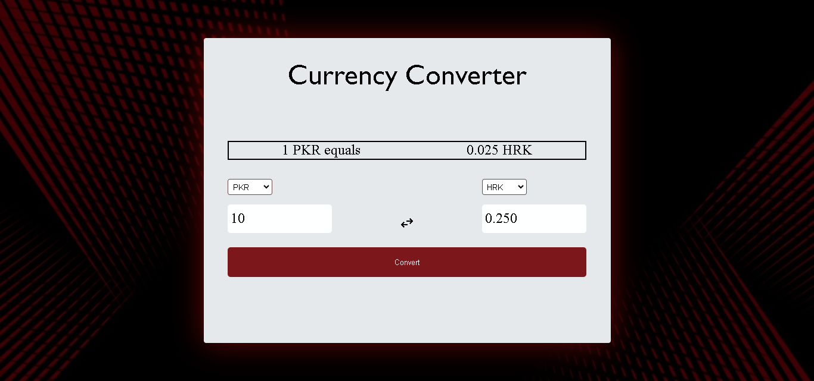

# 💱 Currency Converter Mini Project

This is a mini project that implements a currency converter using the [Fixer.io](https://fixer.io/) API to fetch the latest exchange rates. Users can input an amount, select the source currency, choose the target currency, and convert the amount accordingly.



## 🚀 Features

- Fetches real-time exchange rates from Fixer.io API.
- Allows users to input an amount and select source and target currencies.
- Displays the exchange rate between the selected currencies.
- Supports currency conversion with a button click.
- Provides a swap button to quickly switch the source and target currencies.

## 🌐 Responsive Design

The project is designed to be responsive, providing a seamless experience across various devices:

- **Mobile-Friendly Navigation:**
  - A mobile-friendly navigation bar has been added for easy access to different sections on smaller screens.

- **Flexible Layout Adjustments:**
  - The layout adjusts dynamically for smaller screens, optimizing the user interface.

- **Improved Styling for Smaller Screens:**
  - Font sizes, container widths, and other styles are adapted for better readability on mobile devices.

## 🛠️ Getting Started

To run the project locally, follow these steps:

1. Clone the repository to your local machine:

   ```bash
   git clone https://github.com/ayeshasikander/currency-converter.git
   ```

2. Open the project directory:

   ```bash
   cd currency-converter
   ```

3. Open the `index.html` file in a web browser.

## 📋 Usage

1. Input the amount you want to convert in the source currency input field.
2. Select the source and target currencies from the dropdown menus.
3. Click the "Convert" button to see the converted amount in the target currency.
4. Use the "Swap" button to switch the source and target currencies quickly.

## 📦 Dependencies

- [Fixer.io API](https://fixer.io/): Used to fetch real-time exchange rates.

## 🤝 How to Contribute

If you'd like to contribute to this project, please follow these steps:

1. Fork the repository.
2. Create a new branch for your feature or bug fix.
3. Make your changes and submit a pull request.

## 📄 License

This project is licensed under the [MIT License](LICENSE).

## 🙏 Acknowledgments

- Special thanks to [Fixer.io](https://fixer.io/) for providing the exchange rate data.

---
